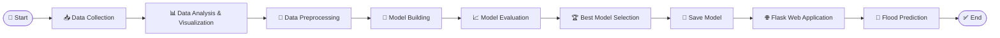

```mermaid
flowchart LR
    A([🚀 Start])
    B[📥 Data Collection]
    C[📊 Data Analysis & Visualization]
    D[🧹 Data Preprocessing]
    E[🤖 Model Building]
    F[📈 Model Evaluation]
    G[🏆 Best Model Selection]
    H[💾 Save Model]
    I[🌐 Flask Web Application]
    J[🌊 Flood Prediction]
    K([✅ End])

    A --> B --> C --> D --> E --> F --> G --> H --> I --> J --> K
```
